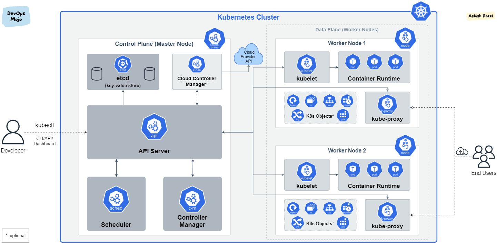

# Introduction to Kubernetes



This section covers the fundamentals of Kubernetes.

* Overview of containerization and container orchestration
* Benefits of using Kubernetes
* Core Kubernetes components

## What is Kubernetes

Kubernetes (k8s) is a system that helps manage and automate the deployment, scaling, and operation of containers.

#### k8s takes care of :

* **Automatic deployments** of containerized applications across different servers
  even in different localisation around the world
* **Distribution of the load** across multiple servers
* **Auto-scaling** of the deployed applications
* **Monitoring** and **health check** of the containers
* **Replacement** of the failed containers

k8s supported container runtimes as

- docker, cri-0, container

## Core Kubernetes Components

* **Kubernetes Cluster**:
  - A Kubernetes cluster contains Nodes.
  - Nodes can be either physical or virtual machines.
  - A cluster consists of a **Control Plane** and **Worker Nodes**.
* **Kubernetes object**

### Components of the Control Plane:

- **API Server**:

  - Acts as the front end for the Kubernetes control plane.
  - Exposes the Kubernetes API.
- **etcd**:

  - A consistent and highly-available key-value store used as Kubernetes' backing store for all cluster data.
- **Controller Manager**:

  - Runs controller processes that handle routine tasks in the cluster.
  - Types of controllers include the Node Controller, Replication Controller, and Endpoints Controller.
- **Scheduler**:

  - Responsible for distributing containers across nodes.
  - Selects a node for the pod to run on based on resource availability.

### Components of Worker Nodes:

- **Kubelet**:

  - An agent that runs on each node in the cluster.
  - Ensures that containers are running in a Pod.
- **Kube-proxy**:

  - Maintains network rules on nodes.
  - Handles routing and load-balancing traffic to pods.
- **Container Runtime**:

  - The software that is responsible for running containers.
  - Examples include Docker, containerd, and CRI-O.

### Kubernetes Objects Types

- **Pod**:Pod is the smallest unit in k8s Pod contains: One or multiple containers, but usually one ,Shared volumes Shared IP address
- **ReplicaSet**: Ensures a specified number of pod replicas are running at any given time.
- **Deployment**: Manages ReplicaSets and provides declarative updates to applications.
- **Service**: Defines a logical set of pods and a policy by which to access them. We have NodePort, ClusterId and Loadbalancer
- **ConfigMap**: Provides a way to inject configuration data into pods.
- **Secret**: Used to store and manage sensitive information, such as passwords and API keys.

### Kubernetes Features

- **Namespaces**: Provide a way to divide cluster resources between multiple users.
- **Persistent Volumes and Persistent Volume Claims**: Manage durable storage in a Kubernetes cluster.
- **Ingress**: Manages external access to services in a cluster, typically HTTP.
- **Custom Resource Definitions (CRDs)**: Extend Kubernetes capabilities by defining new resource types.

### What is Kubectl

Kubectl is a tools in charges of management the k8s cluster in the CLI by communicating with the api server

#### General format 

```sheel
kubectl [command] [TYPE] [NAME] [flags
```

#### Simplified Explanation of `kubectl` Command Syntax


- **`kubectl`**: The command-line tool for managing Kubernetes clusters.
- **`[command]`**: The action you want to perform, like `get`, `create`, `delete`.
- **`[TYPE]`**: The type of Kubernetes object you're dealing with, like `pod`, `service`, `deployment`.
- **`[NAME]`**: The specific name of the object you're targeting.
- **`[flags]`**: Optional parameters to modify the command's behavior, like `-n` for namespace or `-f` for a file.

### Examples

- **List Pods**: `kubectl get pods`
- **Create a Deployment**: `kubectl create deployment myapp --image=myapp-image`
- **Delete a Pod**: `kubectl delete pod myapp-pod`
- **Describe a Service**: `kubectl describe service my-service`
- **Apply a Configuration File**: `kubectl apply -f config.yaml`
- **Scale a Deployment**: `kubectl scale deployment myapp --replicas=3`
- **Get Cluster Info**: `kubectl cluster-info`
- **Get Namespaces**: `kubectl get namespaces`
- **Get Nodes**: `kubectl get nodes`

### Summary

Kubernetes, abbreviated as k8s, is a powerful container orchestration system that automates the deployment, scaling, and management of containerized applications. It ensures high availability, efficient resource utilization, and ease of application lifecycle management.
