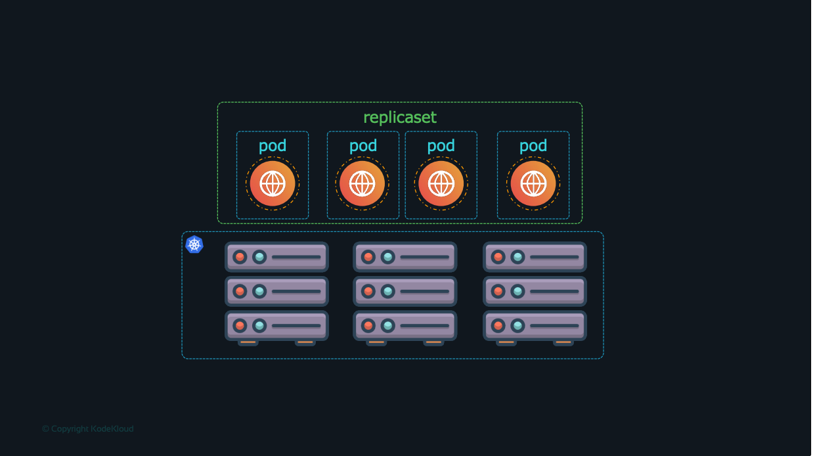
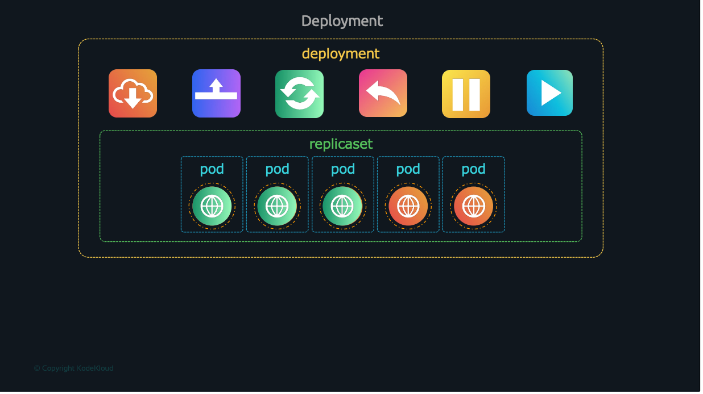

# Kubernetes Object managements 

Default structure of k8s object is 

```yaml
# can be v1 or apps/v1
apiVersion: v1 or apps/v1
# kind of object 
kind: TYPES
# 
metadata:
  name: 
  # kye-value for identification and organize 
  labels:
    
spec:
```

```shell
alias k="kubectl"
```

## Nodes


1. Run image imperative
```shell
k run nginx --image=ngnix
k get nodes
```

2. Run image declarative

**pod-definition.yml**
```yaml
apiVersion: v1
kind: Pod
metadata:
  name: myapp-pod
  labels:
    app: myapp
    type: front-end
spec:
  # array of container
  containers:
  - name: nginx-container
    image: nginx
```
```shell
k apply -f pod-definition.yml

#get all the pods
k get pods

#infos
k describe pod myapp-pod
```


## ReplicaSets


```angular2html
Ensures a specified number of pod replicas are running
```

```yaml
apiVersion: apps/v1
kind: ReplicaSet
metadata:
  name: myapp-replicaset
  labels:
    app: myapp-replicaset
    tier: frontend
spec:
  # modify replicas according to your case
  replicas: 3
  
  # in order to identify existing and new pods 
  selector:
    matchLabels:
      tier: frontend

  # description of a POD
  template:
    metadata:
      labels:
        tier: frontend
    spec:
      containers:
      - name: nginx
        image: nginx
```
save as **app-replicaset.yaml** then run 

```shell
k create -f app-replicaset.yaml

k get replicaset/rs 

k get pods 

# scale the pods to 6 in the file
k scale -–replicas=6 –f app-replicaset.yml

# scale the pods to 6 without changing the file 
k scale -–replicas=6 replicaset myapp-replicaset

k get replicaset

k delete replicaset  myapp-replicaset

k replace -f app-replicaset.yml
```

node that if we want to update the image you need to recreate the rs

## Deployment


Manages a set of identical pods, i allow us to rollback, restore, update 

deployment-definition.yml

```yaml
apiVersion: apps/v1
kind: Deployment
metadata:
  name: nginx-deployment
  labels:
    app: nginx
spec:
  replicas: 3
  selector:
    matchLabels:
      app: nginx
  template:
    metadata:
      labels:
        app: nginx
    spec:
      containers:
      - name: nginx
        image: nginx:1.14.2
        ports:
        - containerPort: 80
```

save as then **deployment-definition.yml** run 

```shell
kubectl create –f deployment-definition.yml

kubectl get deployments

kubectl get replicaset

kubectl get pods
```

To get all pods, replicaset and deployment

```shell
kubectl get all
```

### **Update nginx to 1.7.1**
1. update  deployment-definition.yml 

```shell
kubectl apply –f deployment-definition.yml
```

2. imperative way 

```shell
kubectl set image deployment/nginx-deployment \
nginx=nginx:1.7.1
```