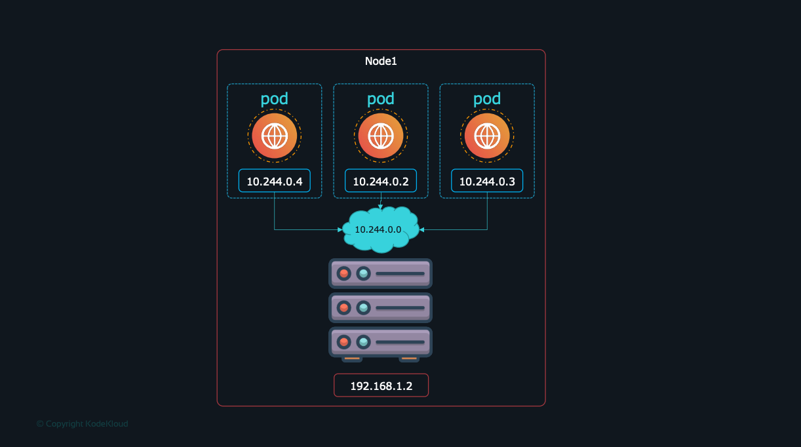
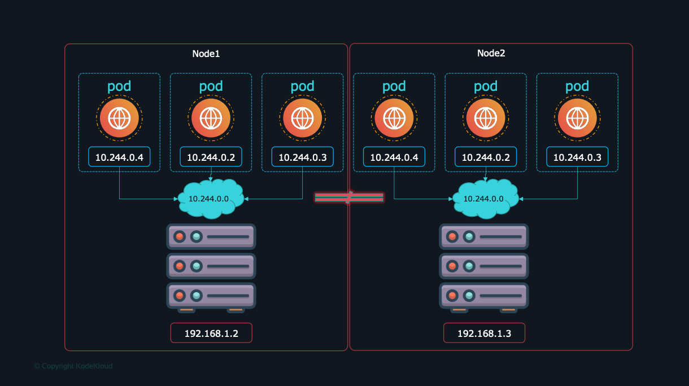
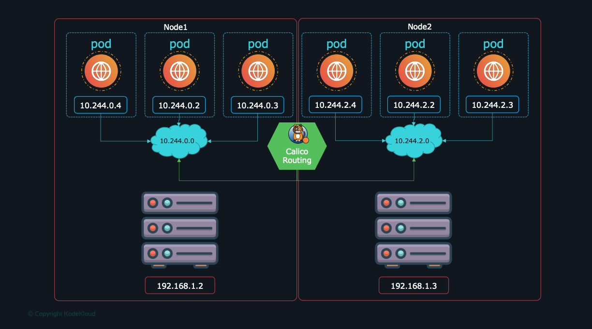

# Kubernetes Networking 

## Context 
- The node have 192.168.1.2. This is the IP address we use to access the kubernetes node, SSH
- Each Pod have its own IP
- K8s have create s 10.244.0.0 to permit communication between the pods
- In each node of our cluster we will have the save config
  
  Fabric, Flannel, Vmware NSX-t and Calico.
  it leads to a problem, the pods can't communicate with each other(IP CONFLIT) so we need a NETWORK solution as **cisco ACI networks, Cilium, Big Cloud
  Fabric, Flannel, Vmware NSX-t and Calico.**
  