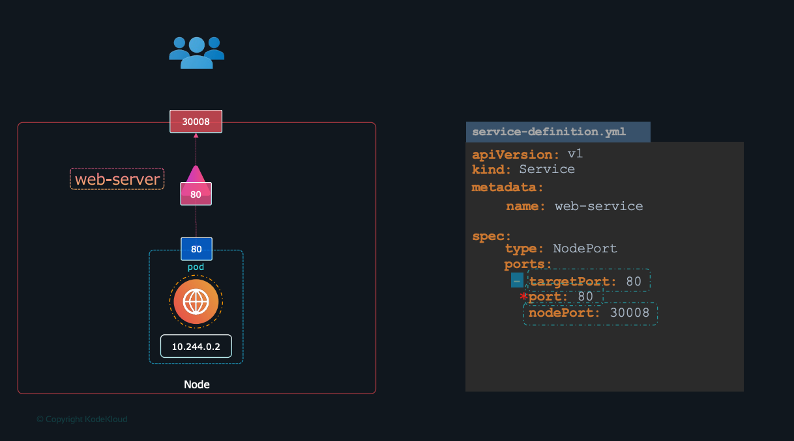

# K8S Services
```text
We  can use Pod IP to connect pod to each other but Pod 
can crashed ou we can start them so the ip changes. 
It is where service comme in
```


Similarly to expose the webservice outside to the external users you would create
another service for the web server. 

## Types of Services 

### ClusterIP
This is a service within the cluster
that is not exposed externally and helps different services communicate with each
other. 

This is the example we saw about the web server reaching the redis service.
the redis db service is a clusterIP type of service.


```yaml
apiVersion: v1
kind: Service
metadata:
  name: redis-db
spec:
    name: redis-db
    type: ClusterIP
    ports:
    - targetPort: 6379
    port: 6379
    selector:
```
save as **service-clusterIp.yml** and run 

```shell
kubectl create -f service-clusterIp.yml

kubectl get services
```

### NodePort
The service exposes the application on a port on the Node to be made accessible to external users through a port on the node.




```kubernetes helm
apiVersion: v1
kind: Service
metadata:
  name: web-service
spec:
  type: NodePort
  selector:
    name: redis
  ports:
    - targetPort: 80
    *port: 80
    nodePort: 3008
  
```

save as **service-nodePort.yaml** and then

```shell
kubectl create -f service-nodePort.yaml

kubectl get services
```

### LoadBalancer