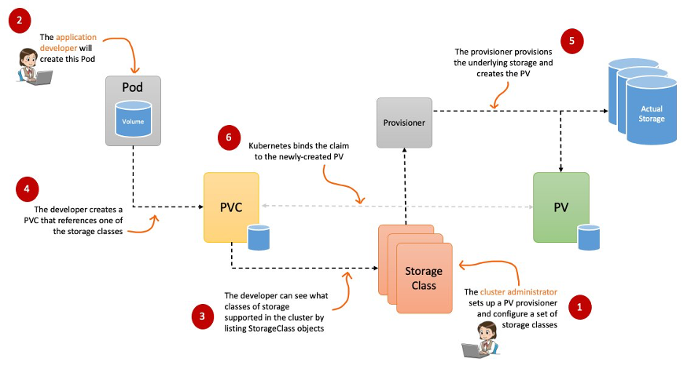

# K8S Storage

Kubernetes provides various storage solutions to manage persistent and ephemeral data. Understanding these options is crucial for managing stateful applications in a Kubernetes cluster.


## Storage Requirements

1. Storage that **doesn't depend** on the **pod lifecycle**
2. Storage must be **available on all nodes**.
3. Storage needs to **survive** even if **cluster crashes**



## Types of Storage

### Volumes
Kubernetes Volumes are basic storage units attached to a Pod. They have the same lifecycle as the Pod and are deleted when the Pod is deleted.
The can be local storage or remote storage. A Node can used both or one.

### Persistent Volumes (PV)
Persistent Volumes are storage resources in a cluster that exist independently of Pods. They are provisioned by an administrator or dynamically provisioned using StorageClasses.
They don't have a namespace, they are globally available for every nodes.

### Persistent Volume Claims (PVC)
Persistent Volume Claims are requests for storage by users(PODS..). A PVC can be thought of as a claim to a resource (PV), and it allows a Pod to use persistent storage.
It must me in the same namespace as the Pod 

### StorageClasses
StorageClasses define the types of storage available in a cluster. They provide a way to describe different types of storage (e.g., SSD, HDD) and the quality of service (QoS).

### ConfigMaps and Secrets
ConfigMaps and Secrets are local volumes create in the pod. They used to store configuration data and sensitive information, respectively. They provide a way to inject configuration data and secrets into Pods.

## Examples

### Creating a Persistent Volume

```yaml
apiVersion: v1
kind: PersistentVolume
metadata:
  name: pv-example
spec:
  capacity:
    storage: 5Gi
  accessModes:
    - ReadWriteOnce
  persistentVolumeReclaimPolicy: Retain
  storageClassName: my_db_volume
  hostPath:
    path: "/mnt/data"
```
Save as **pv-example.yaml** and run:

```shell
kubectl create -f pv-example.yaml
kubectl get pv
```

### Creating a Persistent Volume Claim

```yaml
apiVersion: v1
kind: PersistentVolumeClaim
metadata:
  name: pvc-example
spec:
  accessModes:
    - ReadWriteOnce
  resources:
    requests:
      storage: 5Gi
  storageClassName: my_db_volume
```
Save as **pvc-example.yaml** and run:

```shell
kubectl create -f pvc-example.yaml
kubectl get pvc
```

### Using a Persistent Volume Claim in a Pod

```yaml
apiVersion: v1
kind: Pod
metadata:
  name: pod-using-pvc
spec:
  containers:
    - name: my-container
      image: busybox
      command: [ "sleep", "3600" ]
      volumeMounts:
        - mountPath: "/data"
          name: my-volume
  volumes:
    - name: my-volume
      persistentVolumeClaim:
        claimName: pvc-example
```
Save as **pod-using-pvc.yaml** and run:

```shell
kubectl create -f pod-using-pvc.yaml
kubectl get pods
```

### Creating a StorageClass

```yaml
apiVersion: storage.k8s.io/v1
kind: StorageClass
metadata:
  name: fast
provisioner: kubernetes.io/no-provisioner
volumeBindingMode: WaitForFirstConsumer
```
Save as **storageclass-fast.yaml** and run:

```shell
kubectl create -f storageclass-fast.yaml
kubectl get storageclass
```

### Creating a ConfigMap

```yaml
apiVersion: v1
kind: ConfigMap
metadata:
  name: example-config
data:
  example.property.1: hello
  example.property.2: world
```
Save as **configmap-example.yaml** and run:

```shell
kubectl create -f configmap-example.yaml
kubectl get configmaps
```

### Using a ConfigMap in a Pod

```yaml
apiVersion: v1
kind: Pod
metadata:
  name: pod-using-configmap
spec:
  containers:
    - name: my-container
      image: busybox
      command: [ "sleep", "3600" ]
      envFrom:
        - configMapRef:
            name: example-config
```
Save as **pod-using-configmap.yaml** and run:

```shell
kubectl create -f pod-using-configmap.yaml
kubectl get pods
```

### Creating a Secret

```yaml
apiVersion: v1
kind: Secret
metadata:
  name: example-secret
type: Opaque
data:
  username: YWRtaW4=
  password: MWYyZDFlMmU2N2Rm
```
Save as **secret-example.yaml** and run:

```shell
kubectl create -f secret-example.yaml
kubectl get secrets
```

### Using a Secret in a Pod

```yaml
apiVersion: v1
kind: Pod
metadata:
  name: pod-using-secret
spec:
  containers:
    - name: my-container
      image: busybox
      command: [ "sleep", "3600" ]
      env:
        - name: USERNAME
          valueFrom:
            secretKeyRef:
              name: example-secret
              key: username
        - name: PASSWORD
          valueFrom:
            secretKeyRef:
              name: example-secret
              key: password
```
Save as **pod-using-secret.yaml** and run:

```shell
kubectl create -f pod-using-secret.yaml
kubectl get pods
```

### Conclusion
Kubernetes storage options provide flexibility in managing both ephemeral and persistent data. By using volumes, persistent volumes, claims, and storage classes, you can effectively manage storage for your applications in a Kubernetes cluster.